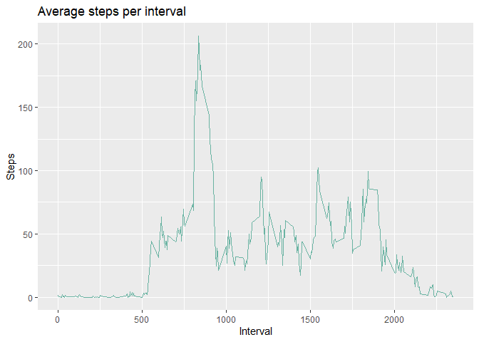
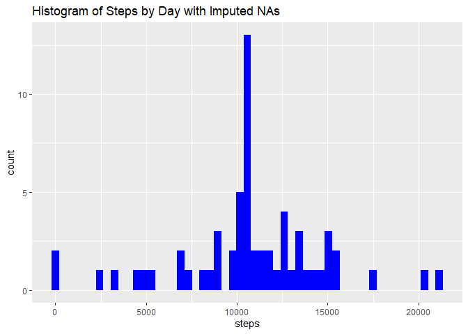
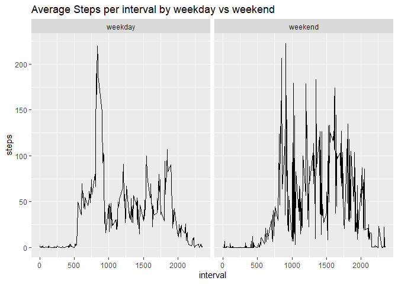

## Loading and preprocessing the data

```r
# read the activity dataset
df <- read.csv("activity.csv")
df <- na.omit(df)
df$date <- ymd(df$date)
```


## 2. What is mean total number of steps taken per day?

```r
df_date <- df %>% 
  group_by(date) %>% 
  summarise(steps=sum(steps))
```

```
## `summarise()` ungrouping output (override with `.groups` argument)
```

```r
#number of days
days <- n_distinct(df_date$date)

g <- ggplot(df_date, aes(steps)) +
  geom_histogram(bins=days, fill="blue") +
  ggtitle("Histogram of Steps by Day")
g
```

<!-- -->

The mean number of steps per day is 1.0766189\times 10^{4} and the median number of steps per day is 10765.


## What is the average daily activity pattern?


```r
ts <- df %>% 
  group_by(interval) %>% 
  summarise(steps=mean(steps))
```

```
## `summarise()` ungrouping output (override with `.groups` argument)
```

```r
g <- ggplot(ts, aes(interval, steps)) +
  geom_line(color="#69b3a2") +
  ggtitle("Average steps per interval") +
  ylab("Steps") +
  xlab("Interval")
g
```

<!-- -->


```r
max_steps <- max(ts$steps)
max_steps_int <- ts$interval[which(ts$steps==max_steps)]

max_steps_int
```

```
## [1] 835
```
The interval which on average contains the max number of steps is ```{r} max_steps_int```.

## Imputing missing values


```r
# read complete csv file without removing "na's"
df_with_missing <- read_csv("activity.csv")
```

```
## 
## -- Column specification --------------------------------------------------------
## cols(
##   steps = col_double(),
##   date = col_date(format = ""),
##   interval = col_double()
## )
```

```r
df_with_missing$date <- ymd(df_with_missing$date)

# code to describe missing data
sum(is.na(df_with_missing))
```

```
## [1] 2304
```

```r
### 2304
sum(is.na(df_with_missing$steps))
```

```
## [1] 2304
```

```r
### 2304 

### All missing values are in steps

# impute the data by substituting the mean of the steps per interval
for(i in 1:nrow(df_with_missing)){
  if (is.na(df_with_missing$steps[i])){
    x <- which(df_with_missing$interval[i] == ts$interval)
    
    #put mean of steps into df_with_missing
    df_with_missing$steps[i] <- ts[x,]$steps
  }
}

# check if it worked
sum(is.na(df_with_missing))
```

```
## [1] 0
```

```r
###0
```


Make a histogram of the total number of steps taken each day and calculate and report the mean and median total number of steps taken per day. Do these values differ from the estimates from the first part of the assignment? What is the impact of imputing missing data on the estimates of the total daily number of steps?

```r
new_df_date <- df_with_missing %>% 
  group_by(date) %>% 
  summarise(steps=sum(steps))
```

```
## `summarise()` ungrouping output (override with `.groups` argument)
```

```r
#number of days
days <- n_distinct(df_date$date)

g <- ggplot(new_df_date, aes(steps)) +
  geom_histogram(bins=days, fill="blue") +
  ggtitle("Histogram of Steps by Day with Imputed NAs")
g
```

<!-- -->

The new mean number of steps per day is 1.0766189\times 10^{4} and the new median number of steps per day is 1.0766189\times 10^{4}.

The difference of the mean is (imputed-nonimputed): 0, and the difference of the median is (imputed-nonimputed): 1.1886792. 

The imputation of the data did not change the results much. 


## Are there differences in activity patterns between weekdays and weekends?

```r
# change name to make df_with_missing shorter
df <- df_with_missing

# add day variable
df$day <- weekdays(df$date)
df$day <- as.factor(ifelse(df$day==c("Saturday", "Sunday"), "weekend", "weekday"))

#average steps for interval across each weekend or weekday

df <- df %>% 
  group_by(interval, day) %>% 
  summarise(steps=mean(steps))
```

```
## `summarise()` regrouping output by 'interval' (override with `.groups` argument)
```

```r
# make a panel plot
g <- ggplot(df, aes(interval, steps))+
  geom_line()+
  facet_grid(~day)+
  ggtitle("Average Steps per interval by weekday vs weekend")
g
```

<!-- -->


# 9. All of the R code needed to reproduce the results (numbers, plots, etc.) in the report

All code is already here. 

In addition, here are the versions of the libraries used. 

```r
sessionInfo()
```

```
## R version 4.0.3 (2020-10-10)
## Platform: x86_64-w64-mingw32/x64 (64-bit)
## Running under: Windows 10 x64 (build 19041)
## 
## Matrix products: default
## 
## locale:
## [1] LC_COLLATE=English_United States.1252 
## [2] LC_CTYPE=English_United States.1252   
## [3] LC_MONETARY=English_United States.1252
## [4] LC_NUMERIC=C                          
## [5] LC_TIME=English_United States.1252    
## 
## attached base packages:
## [1] stats     graphics  grDevices utils     datasets  methods   base     
## 
## other attached packages:
##  [1] knitr_1.30        plotly_4.9.2.2    lubridate_1.7.9.2 forcats_0.5.0    
##  [5] stringr_1.4.0     dplyr_1.0.2       purrr_0.3.4       readr_1.4.0      
##  [9] tidyr_1.1.2       tibble_3.0.4      ggplot2_3.3.3     tidyverse_1.3.0  
## 
## loaded via a namespace (and not attached):
##  [1] tidyselect_1.1.0  xfun_0.19         haven_2.3.1       colorspace_2.0-0 
##  [5] vctrs_0.3.5       generics_0.1.0    viridisLite_0.3.0 htmltools_0.5.0  
##  [9] yaml_2.2.1        rlang_0.4.9       pillar_1.4.7      glue_1.4.2       
## [13] withr_2.3.0       DBI_1.1.0         dbplyr_2.0.0      modelr_0.1.8     
## [17] readxl_1.3.1      lifecycle_0.2.0   munsell_0.5.0     gtable_0.3.0     
## [21] cellranger_1.1.0  rvest_0.3.6       htmlwidgets_1.5.3 evaluate_0.14    
## [25] labeling_0.4.2    fansi_0.4.1       broom_0.7.3       Rcpp_1.0.5       
## [29] scales_1.1.1      backports_1.2.0   jsonlite_1.7.2    farver_2.0.3     
## [33] fs_1.5.0          hms_0.5.3         digest_0.6.27     stringi_1.5.3    
## [37] grid_4.0.3        cli_2.2.0         tools_4.0.3       magrittr_2.0.1   
## [41] lazyeval_0.2.2    crayon_1.3.4      pkgconfig_2.0.3   ellipsis_0.3.1   
## [45] data.table_1.13.2 xml2_1.3.2        reprex_0.3.0      assertthat_0.2.1 
## [49] rmarkdown_2.6     httr_1.4.2        rstudioapi_0.13   R6_2.5.0         
## [53] compiler_4.0.3
```


